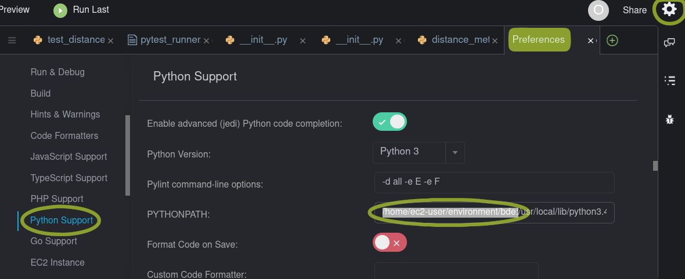
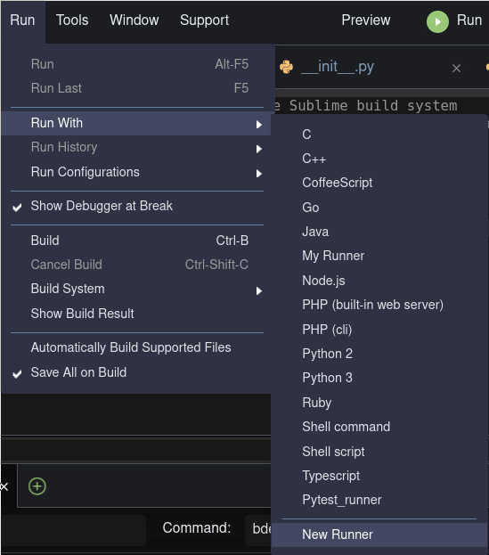

We're using AWS Cloud9 to provide all workshop participants with an IDE that is
quickly set up and where we can install the software required for the course in
a fairly simple way. That way we do not depend on our participants installing
the required software on their own systems, which can be time-consuming, and we
can focus on the essentials of our workshops.

The script [provision.sh], which you find in the same folder as this README
file, should be executed from a POSIX shell, like the bash shell that currently
comes with AWS Cloud9. 

After setting up the environment, using the _provision.sh_ file, you will still
want to modify two settings, at least if you intend to use the IDE using its
menus and keybindings rather than typing commands in the virtual terminal. This
is a 2-step process:

1. Open the preferences window, using the cog icon at the upper right side of
   the IDE. Then navigate in the newly appeared window to "Python Support" and
   adjust there the variable "PYTHONPATH" by prepending what is currently there
   with the path to the repo you have just checked out, making sure to end it
   with a colon. As an example of the PySpark course, you should prepend the
   current value of the PYTHONPATH with:
   `/home/ec2-user/environment/better-data-engineering-with-pyspark:`. Once
   you've made this modification, you may close this panel; you do not need to
   click "save" (or similar) anywhere here.

   

2. You will also want to configure a runner for Pytest. To do so, navigate in
   the menus to _Run > Run With > New Runner_ and replace the contents of the
   text file that appears with the contents of the file [pytest_runner.run].
   Afterwards, you **must save** this file (use the key chord ctrl+s or select
   the relevant option from the IDE menus). You will be asked to give the file
   a name. "pytest" would be a logical choice. It is what you will see in the
   list of runners, similar to what is shown in the screenshot below for the
   "Pytest_runner". The location that the IDE proposes to store the runner is
   fine, simply accept it.

   
