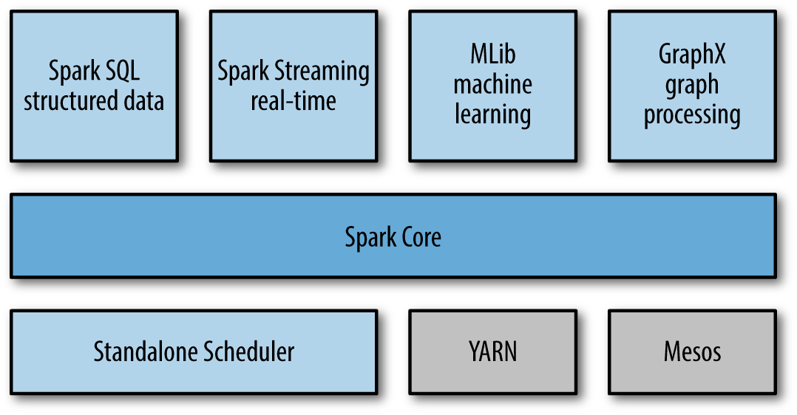
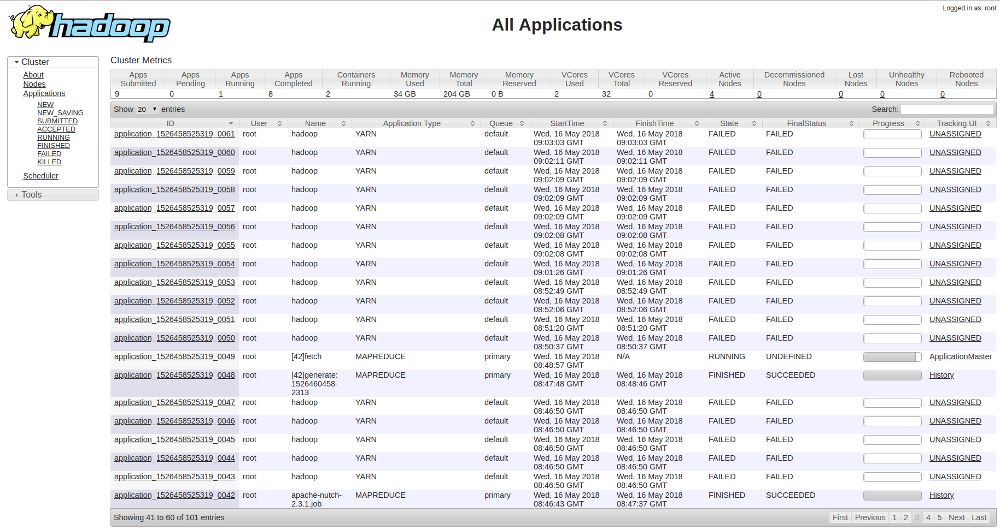

# Hadoop


[Apache Hadoop](https://hadoop.apache.org/) is a software library composed of primarily 4 components:

* Hadoop Common: provides common functionality needed by other Hadoop modules
* Hadoop Distributed File System (HDFS)
  As the name says, it is firstly a _file system_: a way to store and retrieve data from some place, like a hard drive,
  but also discs and tapes. Secondly, it is distributed: the file system is provided by multiple machines, often times
  cheap commodity hardware. While the “bandwidth” (better: the read and write speed) of a specific node may be fairly
  small, the aggregate bandwidth can be very high by splitting files in chunks and distributing these over multiple
  nodes. Keep in mind that it is _purpose-built_ to handle big data.
* Hadoop YARN
    - a negotiator of a cluster's computing resources
    - a scheduler of tasks running on these resources
* Hadoop MapReduce – an _implementation_ of [the MapReduce programming model](https://ai.google/research/pubs/pub36249)
  for large-scale data processing.

Recently, two new modules have been added, [Hadoop Ozone](https://hadoop.apache.org/ozone/)
and [Hadoop Submarine](https://hadoop.apache.org/submarine/). Hadoop isn't just these main components though. It's an
ecosystem: like the Amazon rainforest provides a home for countless animals and plants, and people can benefit from
these, so does the Hadoop ecosystem allow additional software packages to be installed on top of or alongside Hadoop.

Fun fact: “ecosystem” is a fairly well chosen term to describe Hadoop. If you look at the names of some software
packages that are related to Hadoop, such as:
* Apache Hive ,
* Apache Pig ,
* Apache Zookeeper  and
* Apache Impala ,

you'd start to think there are only animal named projects out there. There are exceptions though.

Another fun fact:
Doug Cutting, one of the main developers of Hadoop when it was in its infancy, got inspiration for both the name and the
logo of Hadoop from his then 2-year old son, who had a stuffed animal elephant, which his son called Hadoop (and
stressed on the first syllable, while programmers have stressed the second syllable).
 
Sources: [Youtube - a one minute video featuring Doug Cutting](https://youtu.be/irK7xHUmkUA) and
Quora, [What‘s the origin of the name Hadoop](https://www.quora.com/Whats-the-origin-of-the-name-Hadoop).

Small experiment: can you explain how MapReduce works? Take a deck of cards, with some removed, as a teaching aid and
simulate the computation of finding the largest card value per suit, assuming that non-numbered cards are “bad”.

# Spark


So where does [Apache Spark](https://spark.apache.org/) fit in this big data landscape? Apache Spark, or just “Spark”,
replaces the functionality provided by Hadoop's MapReduce. In fact, most of the time when you see a comparison between
Spark and Hadoop, the author implicitly means Hadoop MapReduce, not the other functionality provided by the Hadoop
framework. This is even the case on the homepage of Spark!

Spark is touted to be 100 times faster than Hadoop MapReduce. It achieves this performance in large part because Spark
does not write intermediate data to persistent storage, like HDFS, unlike MapReduce. A job that depends on the results
of another, will get the data directly, rather than writing away to HDFS, S3 or any other persistent file system. Spark
also allows the developer to _mark_ a dataset to be kept in memory. This is ideal for workloads that need the same input
data. Note that Spark does not do everything in memory as is oftentimes mentioned. Indeed, Spark's shuffling mechanism
is similar to that of MapReduce, something that can be derived by carefully examining the logs of
jobs. [More reading](https://www.quora.com/What-makes-Spark-faster-than-MapReduce#__w2_whh3PCjm9_answer)

## The Spark Stack

“Spark is a framework for doing distributed computing”. It offers 4 high level modules to work with big data in various
use cases. These are:


* Spark SQL & DataFrames
  For working with structured data
* Spark Streaming
  For streaming applications, with exactly-once semantics
* MLlib
  Provides high quality machine learning algorithms
* Graphx
  For graph processing (note to Dutch readers: a graph is not a plot, it is a set of vertices that are linked by edges
  which indicate some kind of relationship.)

All of these modules build further on the Spark core. In this course, **we will be dealing with Spark SQL and the
DataFrame API** in particular. The other modules are less frequently used in business and often use concepts that are
dealt with in Spark SQL and DataFrames. E.g, in the MLlib, many ML pipelines expect a DataFrame as the starting point of
all transformations.

The picture above is not complete (it's a diagram, what do you expect?). The picture below is older, but also shows that
Spark provides functionality to run jobs on a cluster. There are currently 4 cluster
managers [officially supported](https://spark.apache.org/docs/latest/cluster-overview.html#cluster-manager-types):

* Spark Standalone, ideal for getting up and running quickly as it comes with Spark and thus does not require extra
  setup
* Apache Mesos
* Hadoop YARN, the default cluster manager for Amazon's EMR clusters and thus likely the most common one globally at the
  time of writing this (May 2019).
* Kubernetes, an open source project that is rapidly increasing in popularity and traction. All 3 major cloud providers
  currently provide support for Kubernetes.
 


Again, we encounter YARN. We'll come back to it later, to monitor the progress of our cluster jobs.

## Communication between components in a Spark application

The picture below provides a high level overview of the communication between processes in a typical Spark application.
It's so high level, and misses explanation that it's really not that good.


The missing context is this:

1. to start an application, you **submit** it. Either to a cluster resource manager, like YARN, or you run it in a local
   mode (i.e. unclustered). The latter is great for local development and unit tests (you do write unit tests, don't
   you?). An application gets submitted through the `spark-submit` command, which comes with any Spark installation.
2. after submitting, your program will start a SparkContext. The process in which the SparkContext is started is known
   as the _driver process_ or driver program. The SparkContext connects to a cluster manager and asks for a certain
   amount of computing resources.
3. The cluster manager looks for these resources on several nodes (the workers), allocates them to processes (the
   executors) and tells them to report for duty to Spark's SparkContext.
4. After acquiring the executors, Spark sends the application's code to the executors, including all dependencies, so
   that each executor has everything it needs to interpret tasks.
5. Spark finally sends tasks to the executors, which are units of work.

_Question_: which edge in this diagram has not been discussed? Can you come up with a reason for its existence?   
<!-- One of the reasons would be the interprocess communication required for shuffling between stages -->

More reading material: [Spark documentation - cluster overview](https://spark.apache.org/docs/latest/cluster-overview.html).

_Question_: how does High Performance Computing differ from Spark/MapReduce?
<!-- A: Data locality: in high performance computing, you bring the data to the compute engines. In Spark and MapReduce,
you bring the code to the data. For big data, this makes sense: it is more efficient to bring a few kilobytes of code 
closer to the location where the data is stored, rather than transporting lots of data over the network. Have a look 
at the [comparison of latency numbers for various operations](https://people.eecs.berkeley.edu/~rcs/research/interactive_latency.html) -->


## The Spark DataFrame API 

The following are Spark's main API concepts:

- RDDs

  Short for resilient, distributed datasets. They form the backbone of the current default abstraction: the Dataset,
  which was introduced in Spark 1.6. In short, Spark keeps track of an _immutable_ collection of data records. The RDD
  API is still available to you today, but it does not come with many of the rich optimizations that have been added in
  Datasets, such as Spark Catalyst, which optimizes the query plan.
  
- Datasets

  A dataset is a strongly typed collection of objects that are distributed over the workers in your cluster. In
  programming languages that do not support strong typing, such as Python, Datasets do not exist. Instead, one works
  with the dynamically typed DataFrames, which are in
  fact [aliases for Datasets of Row](https://github.com/apache/spark/blob/5a8aad01c2aaf0ceef8e9a3cfabbd2e88c8d9f0d/sql/core/src/main/scala/org/apache/spark/sql/package.scala#L46)
  objects. A DataFrame is then a Dataset organized into named columns, like a table in a relational database or a Pandas
  dataframe in Python, but with richer optimizations under the hood.

- Row

  A Row is similar to a row in a resultset of a relational database, or a line in a spreadsheet. It is an object
  however, so as with all things in object oriented programming, it comes with a rich set of methods that you can apply
  on it. A Row is immutable however: if you want to change the fields, you must create a new Row.

- Column

  an abstraction of a set of data attributes that have similar properties, such as their datatype. Again, very analogous
  to columns in relational databases. Note that columns can contain structures, so they can be nested.
  
- SparkSession

  Your entrypoint in recent versions of Spark (Spark >= 2.0). You can create a minimal SparkSession like this:
  
```python
from pyspark.sql import SparkSession

spark = SparkSession.builder.getOrCreate()
```

  Once you have a SparkSession, the SparkContext is also initialized.

You might have noticed that immutability is a recurring theme in Spark. Indeed, Spark, and many other frameworks, have
embraced immutable objects for the benefits they bring when it comes to programming with state, which is hard. This is
an aspect also found in the functional programming paradigm.

_Questions_:
- Explain like I'm 12: what is a Spark DataFrame? In one word? In less than 5 words?
<!-- in one word: a table. In about 5 words: a distributed collection of immutable data. -->


YARN is an acronym that stands for “Yet Another Resource Negotiator”. Indeed, there are other resource negotiators, such
as [Apache Mesos](https://mesos.apache.org/)
, [hence the name](https://blog.rapid7.com/2014/10/28/mesos-yet-another-cloud-os/)). YARN provides an API, which the
YARN web UI makes use of. That is also the only YARN interface most people who work regularly with compute clusters will
know. The web UI will allow you to track the progress of jobs (even terminate
them [if YARN has been set up that way](https://community.hortonworks.com/content/supportkb/49429/how-to-disable-kill-application-button-in-yarn-web.html))
, monitor the available resources and observe logs.

The web UI looks like this:

On the top, you get to see an overview of your cluster's resources and useful metrics. Just below is a list of all the
applications, which you can filter using the predefined filters on the left. When you dive into a specific job, by
clicking its id, you can access the job's high level logs. If a job provides a tracking UI, with which you can monitor
more details that are specific to this type of job, you can access these through the tracker UI link. Every Spark
application creates a UI upon starting the `SparkContext`. This UI is linked to the YARN tracker UI.